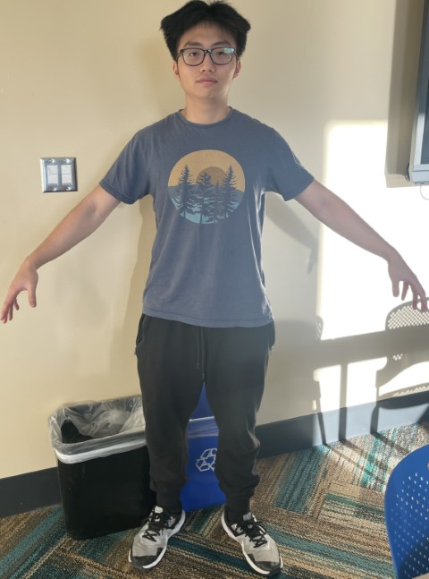
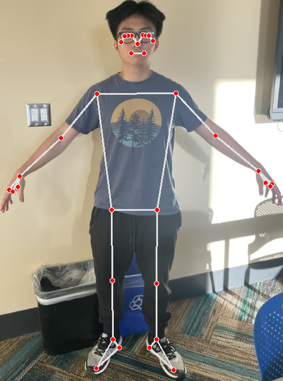

# SculptAI - HackUMass 2023

This project is being developed by the following team members:

- Hung Nguyen
- Minh Vu
- Dang Nguyen
- Duc Vu
- Bao Dang

## Description

Our project aims to create a 3D scanning solution that is both affordable and easy to use. We believe that 3D scanning technology has the potential to revolutionize a wide range of industries, from choosing clothes and seeing if they fit well with personalized 3D models, to creating personal human avatars for games or joining the Metaverse.

Our goal is to build a solution that is fast and accessible under the constraint of time in the hackathon. We figured the best way to achieve this is to only use AI for cropping the iamge and then sculpt the 3D model manually using Blender since training the model for converting from 2D to 3D would cost us a lot of time.

## Installation

Clone the projects below
```
git clone https://github.com/HungNT1st/simple-3d-scan.git
```

Our project requires a pretrained machine learning weights imported from SAM. You can download the pre-trained weights [here](https://dl.fbaipublicfiles.com/segment_anything/sam_vit_h_4b8939.pth)

After installing the requirements, you can run main and try it for yourself!
```
pip -r requirements.txt
python main.py
```

## Process
We were in a rush for the hackathon so this is still a project in progress, but here are the general overview of the process.

1. First the system will take a picture of you:



2. The system tracks your pose and measures the lengths of different parts of your body with MediaPipe:



4. To make the UV mapping process easier, the system crops your image by removing the background:


5. After a while, your 3D model will be generated here. For now, it is not that perfect \:)
 


6. For an extra feature, which is also not working perfectly right now, you can choose to display it using AR on a hard surface or on your hand \:D
 


That's it. Thank you for your time!
